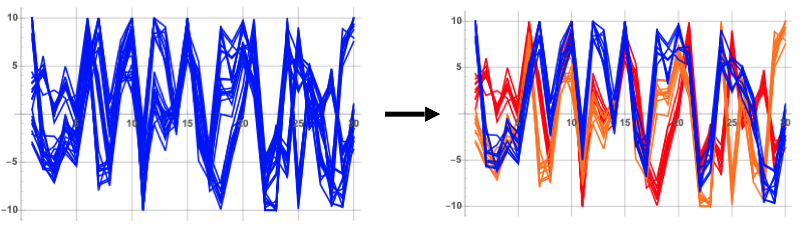
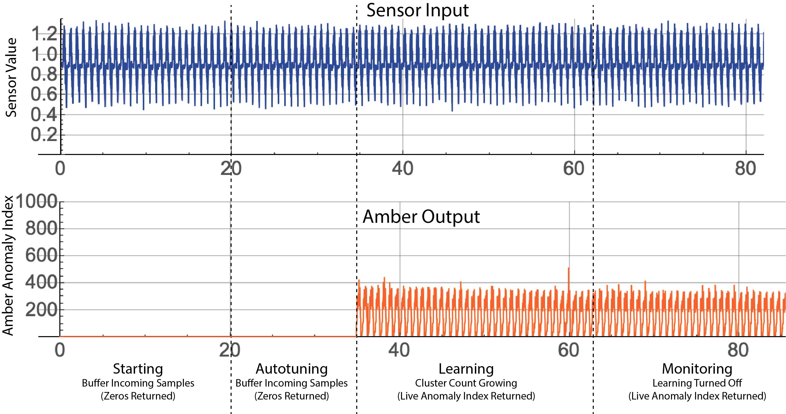
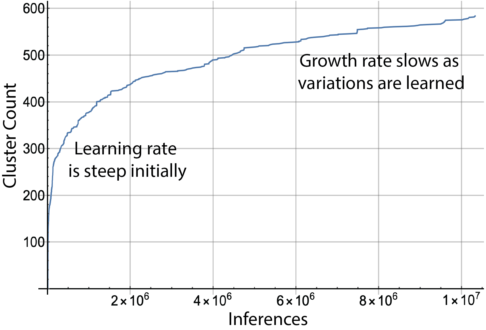

   
# Introduction to Clustering with the Boon Nano

The Boon Nano is a high-speed, high-efficiency, clustering and segmentation algorithm based on unsupervised machine learning. The Nano builds clusters of similar *n*-space vectors (or **patterns**) in real-time based on their similarity. Each pattern has a sequence of **features** that the Nano uses in its measurement of similarity. 

## Examples of Patterns

* **Motor Status Tags:** Industrial motors are controlled by servo feedback loops that have multiple features. A pattern that could be used to built an ML model of motor performance date might be  
(Output Current, Torque Trim, Position, Velocity, Position Error, Velocity Error)
* **Flight Recorder Data:** An aircraft has multiple sensors that define its operating state at any point in time. For example, a pattern might have these features  
(Altitude, Air Speed, Ground Speed, Lateral Acceleration, Longitudinal Acceleration, Vertical Acceleration, Left Aileron Position, Right Aileron Position)   
* **Power Spectra:** The output of vibrational sensors is often transformed into frequency spectra. In this case, the features represent adjacent frequency bands and the value of each feature is the power from the source signal in that frequency band.
* **Triggered Impulsive Data:** If *n* consecutive samples from a single sensor are acquired like a snap shot, they can be compared by shape and clustered by similarity to gain insight about the varieties of signals occurring in the data stream. The snap shot is typically triggered by a threshold crossing of the signal.
* **Single Sensor Streaming Data:**  Consecutive overlapping windows of the most recent *n* samples from a sensor form a natural collection of *n*-dimensional vectors.
* **Histogram of Magnitudes:** This common technique from computer vision builds, for each pixel, a histogram of the grayscale values of the surrounding pixels. If values range from 0 to 255, then these patterns might have 256 featues. Then an image is transformed into a large collection of patterns (one for each pixel) that can be processed through the Boon Nano.

## Using the Boon Nano
The Boon Nano is deployed in both a general-use plaform called **Expert** and as a streaming sensor analytics application called **Amber**
* **Expert:** The Expert console provides the full functionality of the Boon Nano including all analytics (described below) and is oriented toward batch processing of input data.
* **Amber:** By specializing the Expert console for real-time streaming data, Amber provides an easy-to-use interface for sending streams of successive sensor values as a time series and getting back analytic values that correspond one-for-one to the sensor values. These analytic values are typically used for anomaly detection in the sensor stream.   

## Configuring the Boon Nano

### Batch Mode vs. Streaming Mode
The Boon Nano can be operated in batch mode or streaming mode depending on the application.  
* **Batch Mode:** In batch mode, successive patterns clustered by the Nano are not assumed to have any temporal relationship. For instance, segmentation of tissue types from a DICOM CT scan uses batch mode. Anomaly detection for quality control using camera images of standard units on a manufacturing line uses batch mode.
* **Streaming Mode:** In streaming mode, it assumed that successive patterns are temporally related and they typically overlap. Examples of streaming mode data would be overlapping, successive windows of single-sensor data or successive sensor fusion patterns coming off multiple related sensors in real-time. 

### Clustering Configuration
The Boon Nano uses the clustering configuration to determine the properties of the model that will be built for the input data.
* **numericType:** One numeric type is chosen to apply to all of the features in each input vector. A good default choice for numeric type is float32, which represents 32-bit, IEEE-standard, floating-point values. In some cases, all features in the input data are integers ranging from -32,768 and 32,767 (int16) or non-negative integers ranging from 0 to 65,535 (uint16), for instance, bin counts in a histogram. Using these integer types may give slightly faster inference times, however, float32 performance is usually similar to the performance for the integer types. For nearly all applications, float32 is a good general numeric type to use.
* **Feature List:** A pattern is comprised of **features** which represent the properties of each column in the vectors to be clustered. Each feature has a **range** (a min and max value) that represents the expected range of values that feature will take on in the input data. This range need not represent the entire range of the input data. For example, if the range of a feature is set to -5 to 5, then values greater than 5 will be treated as if they were 5 and value less than -5 will be treated as -5. This truncation (or outlier filtering) can be useful in some data sets. Each feature is also assigned a **weight** between 0 and 1000 which determines its relative importance in assignment of patterns into clusters. Setting all weights to 1 is a common setting, which means all features are weighted equally. Setting a weight to 0 means that feature is ignored in clustering as if it were not in the vector at all. Finally, each feature can be assigned an optional user-defined **label** (for example, "systolic", "pulse rate", "payload length", "output current"). Labels have no effect on the clustering.  
* **percentVariation:** The percent variation setting ranges from 1% to 20% and determines the degree of similarity the Nano will require between patterns assigned to the same cluster. Smaller percent variation settings create more clusters with each cluster having more similarity between patterns assigned it. A larger choice for percent variation produces coarser clustering with fewer clusters.
* **streamingWindowSize:** This indicates the number of successive samples to use in creating overlapping patterns. For instance, it is typical in single-sensor streaming mode applications to have only feature and a streaming window size greater than 1. If there is one feature, and the streaming window size is 25, then each pattern clustered by the Nano is comprised of the most recent 25 values from the sensor. In this case, each pattern overlaps 24 samples with its predecessor. In batch mode, it is typical to use a streaming window size of 1.
<table class="table">
  <tr>
    <td></td>
  </tr>
  <tr>
    <td><em>One feature (all samples from the same sensor) and streaming window size of 25. Each input vector is 25 successive samples where we form successive patterns by dropping the oldest sample from the current pattern and appending the next sample from the input stream.</em></td>
  </tr>
</table>

### Autotuning Configuration
Two clustering parameters, the percent variation and the range for each feature, can be *autotuned*, that is, chosen automatically, by the Boon Nano prescanning representative data. The range for each feature can be autotuned either individually or a single range can be autotuned to apply to all features. 

One of the most difficult parameters to configure in unsupervised machine learning is the desired number of clusters needed to produce the best results (as with K-means) or (in the case of the Boon Nano) the desired percent variation to use. This is because one would not generally know *a priori* the underlying proximity structure of the input vectors to be segmented.

To address this, the Boon Nano can automatically tune its percent variation to create an balanced combination of **coherence within clusters** and **separation between clusters**. In nearly all cases, autotuning produces the best value for the percent variation setting. However, if more granularity is desired you can lower the percent variation manually. Similarly, if the autotuned percent variation is creating too much granularity (and too many clusters) then you can choose to manually increase the percent variation above the autotuned value. 

* **autotuneRange:** If this parameter is set to true, the user-supplied range(s) specified in the Nano configuration gets replaced with the autotuned range.   If set to false, the user-supplied range(s) is left intact.
* **autotunePercentV:** If this parameter is set to true, the user-supplied percent variation specified in the Nano configuration get replaced with the percent variation found through the autotuning. If set to false, the user-supplied percent variation is left intact.
* **autotuneByFeature:** If this is set to true and the option to autotune the range is set to true, then the autotuning will find a range customized to each feature. If false, then autotuning will find a single range that applies to all features.
* **exclusions:** An array of exclusions may be provided which causes the autotuning to ignore those features. For instance, if the array [2 7] is provided, then autotuning is applied to all features except the 2nd and 7th features. An empty exclustions array, [ ], means that no features will be excluded in the autotuning.

### Streaming Configuration (Amber Only)
Streaming parameters apply to the Amber deployment of the Boon Nano. If streaming mode is selected in the configuration, then a variety of parameters determine the analytic values returned corresponding to the sensor samples sent into Amber. In its default configuration, Amber returns one *analytic* value for each *sensor* value sent into it. The most typical analytic value is the smoothed anomaly index (SI) (described below), but other outputs can be selected. The streaming window size selected in the clustering configuration (described above) is a key parameter as it determines the amount of sensor value "history" that will be included in each pattern to be clustered.

As sensor values are streamed into it, Amber transitions automatically through four phases: starting, autotuning, learning, and monitoring.

* **Starting:** As the first sensor samples are sent to Amber, there is not sufficient data to return meaningful analytic results. A 0 is returned as the Amber analytic for each sensor value sent. Eventually, a sufficient samples will have been acquired to move to the autotuning phase (e.g. 1000 samples may be sufficient).
* **Autotuning:** Using the autotuning configuration (described above) and the sensor samples buffered thus far, tune the Boon Nano hyperparameters (feature ranges and percent variation) to optimal values for this sensor. During autotuning, Amber continues to return zeros as the anomaly index corresponding to the incoming sensor values.
* **Learning:** Amber configures the Boon Nano with the parameters found during autotuning and then starts training the Nano with the samples that have been buffered thus far. In this phase, the Boon Nano is adding clusters as needed to build a high-dimensional analytic model that describes the sensor input and that conforms to the clustering configuration (described above). There is sufficient data in this phase to return real analytic outputs for each sensor sample sent in. Part of the streaming configuration determines when learning stops, called **graduation**. Graduation occurs automatically based on a number of graduation requirements (described below). In principle, learning can continue indefinitely, but it is usually desirable to automatically turn off learning upon graduation so that no new clusters are created. This solidifies the model so that the future analytics results retain their same meaning over many months of operation.
* **Monitoring:** The final phase of Amber is the monitoring phase where learning has been turned off. Each sensor value sent in becomes the final sample in the streaming window of prior samples. That window is clustered by the Boon Nano in real-time and the result returned as the Amber analytic value for that sample.

The streaming configuration is defined by the following parameters:
* **enableAutotuning** and **samplesToBuffer:** If enableAutotuning is set to true, then incoming sensor samples will be buffered until samplesToBuffer have been collected at which time autotuning begins on the buffered sensor data. Autotuning will typically require approximately 200 more sensor values to complete. Once autotuning is complete, then Amber uses the autotuned ranges and percent variation to configure the Nano.
* **learningGraduation:** If this is set to false, then learning continues indefinitely which means that clusters will continue to be added for patterns that cannot be placed into an existing cluster. Typically, it is set to true in which case the graduation requirements are used to automatically turn off learning if any of the graduation requirements is met.
* **learningMaxClusters (Graduation Requirement):** If during the learning phase, the Nano has a total of learningMaxClusters clusters in its model, then learning is automatically turned off.
* **learningMaxSamples (Graduation Requirement):** If during the learning phase, the Nano has processed a total of learningMaxSamples sensor samples, then learning is automatically turned off.
* **Cluster Growth Slope (Graduation Requirement):** As learning progresses, clusters are added. As the model matures, the growth in the cluster count slows as the Nano has created clusters that account for nearly all of the variation in the input data. The ratio learningRateNumerator divided by learningRateDenominator determines a cluster growth "flatness" threshold. If during the most recent learningRateDenominator inferences, there have been fewer than learningRateNumerator new clusters created, then learning is automatically turned off.

 
## Clustering Results

When a single pattern is assigned an cluster ID, this is called an *inference*. Besides its cluster ID, a number of other useful analytic outputs are generated. 

### Cluster ID (ID)
The Boon Nano assigns a **Cluster ID** to each input vector as they are processed. The first vector is always assigned to a new cluster ID of 1. The next vector, if it is within the defined percent variation of cluster 1, is also assigned to cluster 1. Otherwise it is assigned to a new cluster 2. Continuing this way all vectors are assigned cluster IDs in such a way that each vector in each cluster is within the desired percent variation of that cluster's template. In some circumstances the cluster ID 0 may be assigned to a pattern. This happens, for example, if learning has been turned off or if the maximum cluster count has been reached. It should be noted that cluster IDs are assigned serially so having similar cluster IDs (for instance, 17 and 18) says nothing about the similarity of those clusters. However, PCA (see [Guide: Nano Status](../Guides/Guide_Nano_Status.md)) can be used to measure relative proximity of clusters to each other.

### Raw Anomaly Index (RI)
The Boon Nano assigns to each pattern a **Raw Anomaly Index**, that indicates how many patterns are in its cluster relative to other clusters. These integer values range from 0 to 1000 where values close to zero signify patterns that are the most common and happen very frequently. Values close to 1000 are very infrequent and are considered more anomalous the closer the values get to 1000.

When learning is turned off, patterns with cluster ID of 0 have a raw anomaly index of 1000.

### Smoothed Anomaly Index (SI)
Building on the raw anomaly index, we create a **Smoothed Anomaly Index** which is an edge-preserving, exponential, smoothing filter applied to the raw anomaly indexes of successive input patterns. These values are also integer values ranging from 0 to 1000 with similar meanings as the raw anomaly index. In cases where successive input patterns do not indicate any temporal or local proximity, this smoothing may not be meaningful.

### Frequency Index (FI)
Similar to the anomaly indexes, the **Frequency Index** measures the relative number of patterns placed in each cluster. The frequency index measures all cluster sizes relative to the average size cluster. Values equal to 1000 occur about equally often, neither abnormally frequent or infrequent. Values close to 0 are abnormally infrequent, and values significantly above 1000 are abnormally frequent.

### Distance Index (DI)
The **Distance Index** measures the distance of each cluster template to the centroid of all of the cluster templates. This overall centroid is used as the reference point for this measurement. The values range from 0 to 1000 indicating that distance with indexes close to 1000 as indicating patterns furthest from the center and values close to 0 are very close. Patterns in a space that are similar distances apart have values that are close to the average distance between all clusters to the centroid. 
 
## Example
We now present a very simple example to illustrate some of these ideas. A set of 48 patterns is shown in the figure below. A quick look across these indicates that there are at least two different clusters here. Each pattern has 16 features so we configure the Nano for
* Numeric Type of float32
* Pattern Length of 16

   

We could select the mininum and maximum by visual inspection, but it is not possible to determine the correct Percent Variation this way. So we instead load the patterns into the Nano and tell the Nano to Autotune those parameters. The results comes back with 
* Min = -4.39421
* Max = 4.34271
* Percent Variation = 0.073

We configure the Nano with these parameters and then run the patterns through the Nano, requesting as a result the "ID" assigned to each input pattern. We receive back the following list: "ID" -> {1, 1, 2, 1, 1, 2, 1, 2, 1, 1, 1, 1, 2, 2, 2, 1, 1, 1, 1, 1, 1, 1, 1, 3, 1, 1, 2, 2, 2, 1, 2, 1, 1, 2, 1, 1, 1, 1, 1, 1, 3, 3, 2, 2, 2, 2, 1, 1}  
 
 Comparing this to the sequence in the figure, we see that this is a reasonable clustering assignment. Further, we see that there is a third cluster that may have been missed by our intuitive clustring. This cluster had just three patterns assigned to it. The figure below shows the waveforms plotted on the same axes and colored according according to their assigned cluster IDs. 
 
   
*48 patterns colored according to their assigned clusters*

The Raw Anomaly Index for each of the three clusters are as follows:
* Cluster 1 Raw Anomaly Index: 0
* Cluster 2 Raw Anomaly Index: 170
* Cluster 3 Raw Anomaly Index: 563

This indicates Cluster 1 had the most patterns assigneed to it. Cluster 2 was also common, and Cluster 3 was significantly less common. It is worth noting that a Raw Anomaly Index of 563 would not be sufficient in practice to indicate an anomaly in the machine learning model. Typically, useful anomaly indexes must be in the range of 700 to 1000 to indicate a pattern that is far outside the norm of what has been learned.

**Important Simplifications:** This is an artificially small and simple example to illustrate the meaning of some of the basic principles of using the Boon Nano. In particular, 
* The Boon Nano is typically be used to cluster 100s of millions or billions of patterns.
* The number of clusters created from "real" data typically runs into the hundreds or even thousands of clusters. 
* The speed of the Boon Nano for such a small data set is not noticeable over other clustering techniques such as K-means. However, when the input set contains 100s of millions of input vectors or when the clustering engine must run at sustained rates of 100s of thousands of inferences per second (as with video or streaming sensor data), the Boon Nano's microsecond inference speed makes it the only feasible technology for these kinds of solutions.
